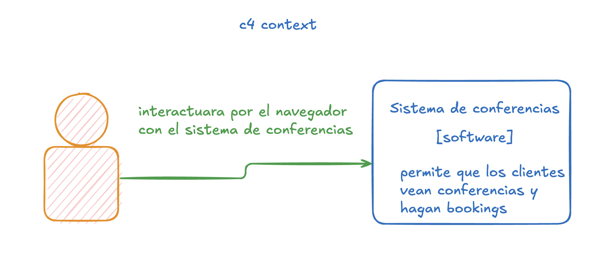

Los diagramas C4 permiten mostrar contextos, contenedores y modulos para que los intersados en un pryecto, sepan como va la causa y como cada sistema interactua entre si!

c4 context diagram
representa el contexto! es para personas tecnicas o no tecnicas

c4 contenedores
abre los sistemas contextuales y los convierte en sistemas tecnicos digeribles
“something that needs to be running in order for the overall system to work”
puede contener o no especificaciones sobre el contenedor, por ejemplo, nodejs aplication, etc